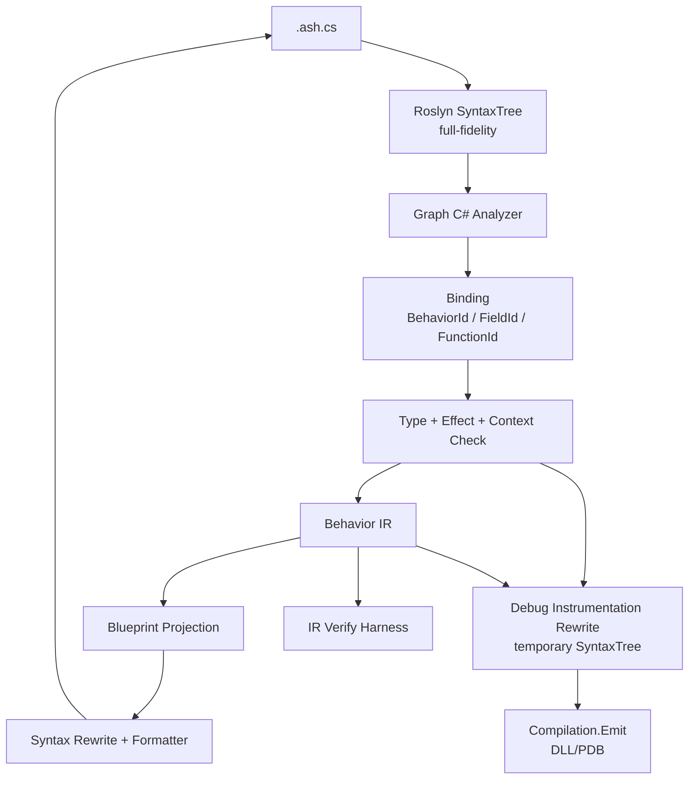

# Graph C# 与蓝图技术验证计划

研究日期：2026-05-15
最近更新：2026-05-17

本文定义 Asharia Engine 后续脚本/蓝图互通的技术验证路线。目标不是立刻把当前引擎 runtime
接入 C#，也不是实现完整可视化编辑器；目标是先验证一条可长期演进的语言与蓝图共同模型：

```text
.ash.cs 是语义资产真相
蓝图是 .ash.cs 的图形投影视图
Behavior IR 是内部编译、分析和 SourceMap 模型
正式运行路径是 .ash.cs -> C# assembly/PDB
IR verifier 只做蓝图调试、投影验证和一致性校验
```

当前 `docs/systems/scripting.md` 中“第一版不做 Visual scripting”的约束仍然成立。本文描述的是
ScriptLab 技术验证和中长期方向，不改变当前 runtime 脚本包的最小边界。

## 设计结论

- 使用合法 C# 子集作为 graph-compatible 文本语言，暂名 Graph C#。
- `.ash.cs` 是用户可读、可 diff、可手写、可由蓝图回写的语义资产。
- 不用 JSON 表示蓝图语义；蓝图节点图由 `.ash.cs` 经 Roslyn 解析、绑定和降低后投影生成。
- `.ashlayout` 只保存节点坐标、折叠状态和注释框等可丢弃编辑器布局。
- Behavior IR 是内部模型，不是用户手写资产；它服务蓝图投影、SourceMap、调试探针和验证，不作为 shipping runtime 的第二套语义。
- 普通 C# 仍可作为节点实现语言或高级脚本语言，但不承诺任意 C# 都可展开为蓝图。
- 只有通过 Graph C# analyzer、绑定、类型检查、effect/context 检查并成功降低到 Behavior IR 的代码，才是“可蓝图”代码。

## 一手资料依据

| 资料 | 关键事实 | 对本方案的影响 |
| --- | --- | --- |
| Roslyn syntax tree: https://learn.microsoft.com/en-us/dotnet/csharp/roslyn-sdk/work-with-syntax | Roslyn syntax tree 是 full-fidelity，能保留 token、空白和注释，并支持分析、重构和代码生成。 | `.ash.cs` 可作为语义真相；蓝图回写可以通过 syntax rewrite 保留源码结构。 |
| Roslyn syntax transformation: https://learn.microsoft.com/en-us/dotnet/csharp/roslyn-sdk/get-started/syntax-transformation | Roslyn 语法树不可变，转换通过创建新树完成；`CSharpSyntaxRewriter` 可替换或插入节点。 | Debug 插桩优先做编译前临时 SyntaxTree rewrite，不污染用户 `.ash.cs`。 |
| Roslyn analyzers: https://learn.microsoft.com/en-us/visualstudio/code-quality/roslyn-analyzers-overview | Analyzer 可在开发期报告代码质量和规则问题。 | Graph C# 子集规则、可蓝图判定和 code fix 可以先做成 analyzer。 |
| Roslyn source generators: https://github.com/dotnet/roslyn/blob/main/docs/features/source-generators.cookbook.md | Source Generator 适合在编译中添加新源码。 | 不用于 probe 插桩，因为它不能作为首选机制改写用户已有方法体。 |
| Roslyn `Compilation.Emit`: https://learn.microsoft.com/en-us/dotnet/api/microsoft.codeanalysis.compilation.emit | Roslyn 可把 compilation 输出为 assembly 和 PDB。 | 正式运行后端优先编译 `.ash.cs`，必要时通过 syntax rewrite 插入调试探针；不急于手写 IL 或维护 IR 运行时。 |
| C# `#line`: https://learn.microsoft.com/en-us/dotnet/csharp/language-reference/preprocessor-directives#line | 生成代码可用 `#line` 把诊断映射回源文件。 | 临时 debug 编译树可辅助定位到 `.ash.cs`，但蓝图调试仍以 SourceMap 为核心。 |
| Portable PDB sequence points: https://learn.microsoft.com/en-us/dotnet/api/system.reflection.metadata.sequencepoint | Portable PDB sequence point 记录 IL offset 到源码行列的映射。 | 暂停定位可通过 PDB sequence point 回到 `.ash.cs` span，再映射到蓝图节点。 |
| Portable PDB local scopes/variables: https://learn.microsoft.com/en-us/dotnet/api/system.reflection.metadata.localscope | Portable PDB 可记录方法内 local scope 和 local variable metadata。 | PDB 可用于枚举当前源码位置附近可见的 locals 名称，但不直接提供运行时值。 |
| CLR debugging `ICorDebugILFrame`: https://learn.microsoft.com/en-us/dotnet/core/unmanaged-api/debugging/icordebug/icordebugilframe-interface | CLR 调试接口可在暂停的 IL frame 上读取参数和局部变量。 | 断点后的参数、locals、`this` 字段值应从 debugger frame 读取，而不是默认全量插 `DebugProbe.Value`。 |
| Debug Adapter Protocol: https://microsoft.github.io/debug-adapter-protocol/specification | DAP 定义 stopped、stackTrace、scopes、variables 等调试前端协议。 | Editor 与调试后端之间优先采用 DAP 形状的会话接口，后端可先接现成 adapter，必要时再落到 ICorDebug。 |
| CLR Profiling API: https://learn.microsoft.com/en-us/dotnet/framework/unmanaged-api/profiling/profiling-overview | Profiler API 可观察和改写 CLR 执行，但需要 profiler 组件和较复杂部署。 | 第一版不采用 Profiler/ReJIT 做蓝图高亮或 pin value。 |
| Mono.Cecil: https://www.mono-project.com/docs/tools+libraries/libraries/Mono.Cecil/ | Mono.Cecil 可读写 managed assemblies。 | IL weaving 可作为后续优化方向，但第一版不把 IL 重写作为主路径。 |
| Language Server Protocol: https://microsoft.github.io/language-server-protocol/specifications/lsp/3.17/specification/ | LSP 定义 diagnostics、completion、semantic tokens、code action 等语言服务协议。 | 后续 Graph C# 编辑器、IDE 和引擎内文本编辑可共用语言服务。 |
| Unity Visual Scripting: https://docs.unity3d.com/Manual/com.unity.visualscripting.html | Unity 的图形脚本通过图节点调用 Unity API、自定义 C# 节点和事件。 | C# 生态适合提供节点库；蓝图负责编排，不需要自研完整通用语言生态。 |
| Unreal exposing gameplay to Blueprints: https://dev.epicgames.com/documentation/en-us/unreal-engine/exposing-gameplay-elements-to-blueprints-visual-scripting-in-unreal-engine | Unreal 用反射标注把 C++ 函数、属性和事件暴露给 Blueprint。 | Asharia 应通过 Script Context / BindingRegistry 暴露节点，不默认反射所有 C++ 或 C# API。 |
| Godot exported properties: https://docs.godotengine.org/en/stable/tutorials/scripting/gdscript/gdscript_exports.html | GDScript export 字段可保存到 scene/resource 并显示在 Inspector。 | Graph C# 的 public 字段默认暴露；private 字段用 `[SerializeField]` 显式暴露，`[Field(...)]` 只作为自定义稳定 ID 或迁移工具。 |

## 资产形状

```text
PlayerMove.ash.cs       语义真相，合法 C# 子集
PlayerMove.ashlayout    图布局缓存，可删除后重建
PlayerMove.behavior     cook/build 缓存产物，来自绑定结果、SourceMap 和 Behavior IR
PlayerMove.Generated.cs 可选诊断导出，不是语义资产
```

`.ashlayout` 不保存语义。如果 `.ashlayout` 丢失，编辑器必须能从 `.ash.cs` 重新生成蓝图节点，只是布局回到自动排布。

示例 `.ash.cs`：

```csharp
using Asharia.Behavior;

namespace Game;

public class PlayerMove : BehaviorComponent
{
    [Range(0f, 20f)]
    public float Speed = 4.0f;

    protected override void Update(float delta)
    {
        if (Input.KeyDown(Key.W))
        {
            Transform.Translate(Self, new Vec3(0f, 0f, Speed * delta));
        }
    }
}
```

对应蓝图投影：

```text
[Update(delta)]
      |
[Input.KeyDown Key.W]
      |
[Branch]
      |
[Transform.Translate(Self, Vec3(0, 0, Speed * delta))]
```

## Graph C# 子集

第一版允许：

- `using`、`namespace`。
- `class <Name> : BehaviorComponent`；`public`、`sealed`、`partial` 可写但不强制。
- public instance 字段默认是可序列化、可 Inspector 显示、可蓝图连接的行为字段。
- private/protected 字段默认不是行为字段；需要 `[SerializeField]` 或 `[Field(...)]` 显式暴露。
- `[Behavior("...")]` 可选，只在需要自定义稳定 ID、跨命名空间迁移或兼容旧资产时使用。
- `[Field("...")]` 可选，只在需要自定义稳定字段 ID、跨字段迁移或和外部 schema 对齐时使用。
- `[FormerlyBehavior("Old.Id")]`、`[FormerlyField("OldName")]` 作为重命名兜底；常规编辑器重命名应同步更新资源引用。
- 生命周期方法：`Start()`、`Update(float delta)`、`FixedUpdate(float delta)`、`Destroy()`。
- 私有 helper method，但 helper method 也必须满足 Graph C# 子集。
- 局部变量、赋值、`if` / `else`、`return`。
- 注册函数调用、注册字段读写、基础数学表达式。
- `new Vec2(...)`、`new Vec3(...)`、`new Vec4(...)`、`new Quat(...)`、`new Color(...)` 等值类型构造。
- enum 常量、bool/int/float/string 字面量。

第一版禁止：

- `async` / `await`、`yield`。
- lambda、匿名方法、LINQ query 或 fluent LINQ。
- `dynamic`、reflection、`typeof(...).Get*()` 这类动态检查。
- `unsafe`、指针、`stackalloc`。
- `try` / `catch` / `finally`、`throw`。
- `goto`、`lock`、`Thread`、`Task`。
- delegate / event 声明和任意 callback pipeline。
- 复杂泛型、用户自定义 operator、隐式转换链。
- 任意 `new` 引用类型。
- static mutable state。
- 未注册 API 调用。

循环默认暂缓。第一版如果必须支持遍历，只允许注册节点形式，例如 `ForEachEntity(query, handler)`，并把 handler
作为受控图结构或黑盒节点处理。

## 可蓝图判定

一段 `.ash.cs` 是可蓝图代码，当且仅当它能完整通过以下阶段：

```text
Roslyn SyntaxTree
  -> Graph C# analyzer
  -> Schema / BindingRegistry binding
  -> Type check
  -> Effect / Context check
  -> Behavior IR lowering
  -> Blueprint projection
```

建议诊断码：

| 诊断码 | 含义 | 示例 |
| --- | --- | --- |
| `AGC0001` | Unsupported syntax | lambda、`await`、`try`、`goto`。 |
| `AGC0002` | Unsupported expression | LINQ query、dynamic member access。 |
| `AGC0003` | Unregistered function call | 调用了没有 `FunctionId` 的普通方法。 |
| `AGC0004` | Ambiguous field identity | 同一 Behavior 内 FieldId 冲突，或 `[FormerlyField]` 指向不唯一。 |
| `AGC0005` | Illegal context call | `Update()` 调 editor-only API。 |
| `AGC0006` | Hidden side effect | pure 表达式中调用 mutating API。 |
| `AGC0007` | Unsupported loop | 使用未受控 `while` / `for`。 |
| `AGC0008` | Unsupported type | 使用不可保存或不可图形化类型。 |
| `AGC0009` | Unsupported allocation | `new` 任意引用对象。 |
| `AGC0010` | Source map unavailable | 无法建立源码 span 到 IR/graph 的映射。 |

局部变量是可蓝图结构，不应默认报错。例如：

```csharp
protected override void Update(float delta)
{
    var amount = Speed * delta;
    Transform.Translate(Self, new Vec3(0f, 0f, amount));
}
```

可以投影为：

```text
[Get Speed] [Get delta]
      \       /
      [Multiply]
          |
 [Set Local amount]
          |
 [Get Local amount]
          |
 [Make Vec3]
          |
 [Transform.Translate]
```

如果 `amount` 只使用一次，编辑器可提示可内联，但不能把它判为不可蓝图。

## 局部变量与图显示策略

局部变量必须在语义层存在，但不必在默认蓝图视图里都显示成节点。

规则：

- IR 必须保留 `StoreLocal` / `LoadLocal`，用于源码回写、调试、断点和错误定位。
- Blueprint graph 模型必须支持 Local 节点，因为多次使用、重新赋值、跨分支使用和 Watch 都需要稳定对象。
- 默认视图可以折叠简单局部变量：只赋值一次、只使用一次、initializer 是 pure expression、没有断点或 Watch 时，可以显示为直接连线。
- 折叠后可以在 wire 或目标 pin 上标注局部变量名，例如 `amount`，但不改变底层 IR。
- 只要用户显式 `Promote to Local`、添加 Watch、设置断点，或局部变量被多处使用，编辑器必须展开 Local 节点。

示例：

```csharp
var amount = Speed * delta;
Transform.Translate(Self, new Vec3(0f, 0f, amount));
```

默认紧凑视图：

```text
Speed + delta -> Multiply -- amount --> Make Vec3 -> Transform.Translate
```

调试或展开视图：

```text
Speed + delta -> Multiply -> Set Local amount -> Get Local amount -> Make Vec3 -> Transform.Translate
```

局部变量默认不显示运行时数值。只有断点命中、单步、Watch 或 Pin Inspect 时，才采集和显示局部变量值。

## 身份与重命名

默认身份规则：

- `BehaviorId` 默认是 `namespace + class name`，例如 `Game.PlayerMove`。
- `[Behavior("com.game.PlayerMove")]` 可覆盖默认 `BehaviorId`，主要用于旧资产兼容、跨命名空间迁移或插件公开 API。
- `FieldId` 默认以字段名为种子，并作用域限定在 `BehaviorId` 内；不同 Behavior 可以有同名字段。
- public 字段默认参与序列化和蓝图；private/protected 字段只有显式 `[SerializeField]` 或 `[Field(...)]` 才参与。
- 编辑器内重命名字段或类时，资源系统必须同步更新引用；外部文本重命名无法捕获时，用 `[FormerlyField("OldName")]` 或 `[FormerlyBehavior("Old.Id")]` 迁移。
- 运行时和 cooked 资产只使用绑定后的 `BehaviorId`、`FieldId`、`FunctionId`，不动态查找 C# 成员名。

## BindingRegistry

Graph C# 不把 C# 符号名作为运行时 lookup key。绑定阶段必须把源码符号映射到运行时稳定 ID：

```text
PlayerMove
  -> BehaviorId: Game.PlayerMove

Speed
  -> BehaviorId: Game.PlayerMove
  -> FieldId: Speed

Transform.Translate(...)
  -> FunctionId: asharia.transform.translate

Self
  -> 当前 ScriptInstance 的 EntityRef
```

节点 API 可以由 C# attribute、C++ binding 或 schema/script context 注册：

```csharp
[Node("asharia.transform.translate")]
[AllowedContext(ScriptContext.RuntimeUpdate)]
[MutatesWorld]
public static void Translate(EntityRef entity, Vec3 offset);
```

第一版 BindingRegistry 只需要支持：

- 函数名到 `FunctionId`。
- 参数名、参数类型、返回类型。
- pure/read/mutate/spawn/destroy 等 effect flags。
- allowed contexts。
- debug display name 和 graph category。

## 编译与投影管线



关键约束：

- Runtime 以 C# 编译产物为权威，不从 IR 重新解释玩家逻辑。
- IR 是蓝图投影、SourceMap、静态分析和 verify harness 的共同结构。
- `verify-ir` 可以帮助验证图投影是否和源码意图一致，但不能作为 `.ash.cs` 运行失败时的 fallback。
- Debug instrumentation rewrite 只生成临时编译树，不写回用户 `.ash.cs`。
- Source Generator、IL weaving、Profiler/ReJIT 不作为第一版主路径；它们只作为后续扩展或性能优化备选。

## Debug 插桩策略

第一版使用 Roslyn 编译前 SyntaxTree rewrite 插入 probe。用户源码保持干净，编译管线生成临时 debug syntax tree，再交给 `Compilation.Emit` 输出 DLL/PDB。

插桩前：

```csharp
if (Input.KeyDown(Key.W))
{
    Transform.Translate(Self, new Vec3(0f, 0f, Speed * delta));
}
```

插桩后的临时编译树可以是：

```csharp
DebugProbe.Enter(1024);
var __ash_tmp0 = Input.KeyDown(Key.W);
DebugProbe.Value(1024, "result", __ash_tmp0);

if (__ash_tmp0)
{
    DebugProbe.Enter(1025);
    Transform.Translate(Self, new Vec3(0f, 0f, Speed * delta));
}
```

约束：

- `DebugProbe.Enter(probeId)` 只报告执行位置和查询动态断点表，不能改变表达式语义。
- `DebugProbe.Value(probeId, pinId, value)` 只在 Watch、Pin Inspect 或 value-instrumented debug build 中插入。
- `probeId` 来自 `ProbeManifest`，manifest 再映射到 graph node、source span 和 pin。
- 字段值不插 `Value` probe，字段由 Inspector 读取挂载实例。
- `#line` / PDB / SourceMap 必须让临时代码诊断回到原 `.ash.cs` span。
- 新增、删除、启用、禁用普通断点只改 runtime breakpoint table，不重新编译。
- 只有源码语义变化、从无 probe build 切换到 debug probe build、或新增未插桩 pin value 观察时才需要重新编译。

非首选方案：

- Source Generator：适合添加辅助源码，不作为改写现有方法体的 probe 插桩主机制。
- IL weaving：可在后续用于 release diagnostics 或更底层优化，但第一版会增加 PDB/sequence point 维护成本。
- Profiler/ReJIT：适合高级运行时 instrumentation，但部署、平台和权限复杂度过高，不进入 ScriptLab 第一轮。

## 手写调试观察 API

用户也可以在 `.ash.cs` 中手写观察点，但不直接调用底层 `DebugProbe`。公开 API 使用 `GraphDebug`：

```csharp
var amount = GraphDebug.Inspect("amount", Speed * delta);

var offset = GraphDebug.Inspect(
    "offset",
    new Vec3(0f, 0f, amount));

Transform.Translate(Self, offset);
```

或用于语句式观察：

```csharp
GraphDebug.Watch("speed", Speed);
```

设计规则：

- `GraphDebug.Inspect<T>(name, value)` 返回 `value`，因此可以包住表达式。
- `GraphDebug.Watch<T>(name, value)` 只记录观察值，不参与表达式求值结果。
- 编译器/analyzer 将 `GraphDebug.*` 识别为调试观察节点，绑定到 `probeId` / `pinId` / SourceMap。
- Debug build 中，rewriter 可把它降到底层 `DebugProbe.Value(probeId, pinId, value)`。
- Release build 中，`Inspect` 应退化为返回原值，`Watch` 应退化为空操作。
- 手写 `GraphDebug.*` 属于源码，随 `.ash.cs` 保存；蓝图临时 Watch 属于 editor/debug session 或 `.ashlayout`，不改源码。
- 用户不应直接调用 `DebugProbe.Enter` 或传入底层 `probeId`，这些属于编译产物和 manifest 层。

蓝图表现：

```text
[Watch: amount] = 0.064
[Watch: offset] = Vec3(0, 0, 0.064)
```

蓝图编辑只修改 `.ash.cs`。典型回写：

| 蓝图操作 | `.ash.cs` 改写 |
| --- | --- |
| 修改常量 pin | 替换 literal expression。 |
| 新增调用节点 | 插入 expression statement。 |
| 删除调用节点 | 删除 statement 或 expression tree。 |
| 重排执行线 | 重排 block statements。 |
| 新增 Branch | 生成 `if (...) { ... }`。 |
| 修改字段 pin | 替换 field initializer 或 assignment expression。 |

## Behavior IR

Behavior IR 是内部模型，第一版只需表达图兼容行为：

```text
BehaviorModule
  components
  fields
  events
  functions

FunctionIR
  params
  locals
  basicBlocks
  instructions
```

第一批指令：

```text
LoadConst
LoadField
StoreField
LoadLocal
StoreLocal
CallFunction
Branch
Return
MakeStruct
BinaryOp
```

示例 IR dump：

```text
event Update(delta: Float)
  t0 = Call asharia.input.keyDown(Key.W)
  Branch t0 then B1 else B2
B1:
  t1 = LoadField FieldId(Speed) // scoped by BehaviorId Game.PlayerMove
  t2 = BinaryOp Mul t1, delta
  t3 = MakeStruct Vec3(0, 0, t2)
  Call asharia.transform.translate(Self, t3)
B2:
  Return
```

## C# 运行验证模型

正式执行路径是 `.ash.cs -> optional debug SyntaxTree rewrite -> Roslyn Compilation.Emit -> assembly/PDB -> ScriptHost`。IR verifier 只在 ScriptLab 中做 observed call 对比和 SourceMap 校验，不进入 shipping runtime。

```text
ScriptHost
  AssemblyCache
  BehaviorType table
  ScriptInstance table
  DebugProbeSink
  EventQueue
  MutationQueue
  Diagnostics
```

正式运行路径只认：

- 编译后的 `.ash.cs` assembly/PDB。
- `BehaviorId`、`FieldId`、`FunctionId`。
- `EntityRef`、`AssetRef`。
- `ScriptExecutionContext`。

资产身份不依赖：

- 蓝图节点坐标。
- `.ash.cs` 的 C# 成员名。
- C++ offset 或裸指针。
- Vulkan/RHI handle。

World 修改必须走 mutation queue：

```text
Graph C# / Blueprint
  -> CallFunction asharia.transform.translate
  -> enqueue SetComponentField / command
  -> world safe point validate + apply
```

## 运行时值显示模型

Behavior 是可挂载组件。运行时值显示分为两类，不混用：

```text
Entity + BehaviorId + FieldId
  -> 当前挂载 BehaviorComponent 实例字段值
```

字段值：

- public 行为字段默认显示在 Inspector，可读写当前挂载实例的值。
- private/protected 字段只有 `[SerializeField]` 或 `[Field(...)]` 才显示。
- 蓝图中的字段 pin 可以显示当前字段值，例如 `Speed = 4.0`。
- 字段值来自组件实例/序列化字段绑定，不依赖 DebugProbe。

执行过程值：

- `Update(float delta)` 的参数、局部变量、表达式临时值、函数返回值和分支结果不是序列化字段。
- 这些值默认不在蓝图上实时显示。
- 断点命中、单步、蓝图临时 Watch、Pin Inspect、手写 `GraphDebug.Inspect/Watch` 时，通过 C# 插桩 `DebugProbe.Value(...)` 或 PDB debugger 采集。
- 非暂停运行时默认只显示节点/执行线高亮，不采集所有 pin value。

示例插桩形状：

```csharp
DebugProbe.Enter(2048);
var amount = Speed * delta;
DebugProbe.Value(2048, "result", amount);

DebugProbe.Enter(2049);
Transform.Translate(Self, new Vec3(0f, 0f, amount));
```

设计边界：

- Inspector 负责组件状态。
- DebugProbe 负责执行轨迹和临时值。
- GraphDebug 是用户可写的高级观察 API，DebugProbe 是编译器/runtime 内部 API。
- IR verifier 只用于校验图投影和 observed calls，不负责正式运行时取值。

## 调试与 SourceMap

每个 compiled behavior 必须带 SourceMap：

```text
IR instruction -> debugSiteId
debugSiteId -> .ash.cs file / line / column / source span
debugSiteId -> current blueprint node id / pin id
debugSiteId -> C# probe id optional
debugSiteId -> PDB sequence point / method / IL offset optional
Behavior field -> inspector property path
```

`ScriptDebugMap` 最小字段：

```text
ScriptDebugMap
  buildId
  assemblyMvid
  pdbId
  sourceDocumentPath
  sourceChecksum
  behaviorId
  functionId
  debugSiteId
  irInstructionId
  sourceSpan
  sourceTextHash
  graphNodeId(current)
  breakabilityHint(from IR)
  breakableVerified(from PDB/debug backend)
  owningBreakableDebugSiteId
  probeId(optional)
  methodToken(optional)
  ilOffset(optional)
  ilOffsetRange(optional)
  pdbSequencePoint(optional)
  localScope(optional)
```

约束：

- `buildId`、`assemblyMvid`、`pdbId`、`sourceChecksum` 必须一起校验，防止 UI 用旧 PDB 或旧 DebugMap 映射新源码。
- `breakabilityHint` 只来自 IR/节点类型，用于 UI 预判；最终能否打真实断点必须由 emitted PDB sequence point、IL offset 或 debug adapter verified breakpoint 确认。
- DebugMap 读取 Portable PDB 后才能把 `breakableVerified` 置为 true；没有 PDB 验证的节点只能显示为 provisional。

调试目标：

- 编译错误定位到 `.ash.cs` span 和蓝图节点。
- 运行时错误定位到 `.ash.cs` span、蓝图节点、entity、component、field 和 `FunctionId`。
- 断点可以打在 `.ash.cs` 行或蓝图节点上。
- Inspector 可在运行中显示挂载 Behavior 的字段值。
- IR verifier 模式只用于实验性 step/continue、查看 locals 和 pin values。
- 正式 C# 运行路径可插入 `DebugProbe.Enter(debugSiteId/probeId)`，但 probe 只服务 Trace/Watch/Pin Inspect；暂停断点通过 debugger source/IL breakpoint 实现。

断点、Trace 和 Watch 的边界：

```text
Breakpoint = 真调试断点，暂停整个 debuggee 进程
Trace / Watch = 非暂停观测，聚合、采样、限流
DebugMap = 源码、蓝图、IR、PDB、probe 的唯一映射真相
```

断点绑定规则：

- `debugSiteId` 是当前构建内的调试位置身份，来自 Behavior IR instruction；`graphNodeId` 只用于当前蓝图视图，不能作为持久化断点身份。
- 持久化断点保存 `breakpointAnchor`，至少包含 `behaviorId`、`functionId`、源码 span、源码片段 hash、节点/语句类型和 sibling/context ordinal；重编译后通过 DebugMap 重新绑定为 `debugSiteId`。
- DebugMap 为每个节点标记 `breakabilityHint`、`breakableVerified`、`observable` 和 `owningBreakableDebugSiteId`。
- `Branch`、statement `Call`、`Assign`、`Return`、statement `Watch` 这类 statement/control 节点可作为可断候选；是否能映射到真实 debugger breakpoint，必须以 PDB/IL 或 debug adapter 返回的 verified breakpoint 为准。
- `Const`、`GetField`、`GetLocal`、`BinaryOp`、`MakeStruct` 等表达式节点通常共享外层语句的 PDB sequence point；它们默认用于高亮、Trace、Watch 或 Pin Inspect，设置断点时自动落到 `owningBreakableDebugSiteId`。
- 代码侧断点以 debugger 返回的 verified breakpoint 或命中时 frame 的实际 PDB sequence point 为事实；请求位置只是用户意图。
- 用户把断点打在 `{`、空行、注释或不可执行 token 上时，DebugSession 先使用 debugger verified location；若后端没有返回精确 verified location，再用 Roslyn SyntaxTree 归一化到所属 block 的 owning breakable site：方法体 `{` 对应 Event/Entry 或 source-only，`if` 的 `{` 对应 Branch，`else {` 对应 Branch 的 else arm，普通 block `{` 对应 block 内第一条可执行语句。
- 如果实际暂停位置无法映射到蓝图节点，源码编辑器仍高亮当前位置，蓝图显示 `source-only` 状态。
- `#line hidden` probe 位置不能作为通用 source breakpoint fallback；hidden probe 只用于隐藏插桩单步和非暂停观测。fallback 顺序是 source/PDB breakpoint、DAP instruction breakpoint（若 adapter 支持）、ICorDebug IL offset breakpoint、最后退化为 Trace/Watch，不伪装成真断点。

### PDB/debugger frame 变量读取计划

断点命中后的变量显示不应依赖全量 `DebugProbe.Value(...)` 插桩。默认路径应是：

```text
Graph breakpoint
  -> graphNodeId(current view)
  -> DebugMap resolves debugSiteId
  -> source span / PDB sequence point / IL offset
  -> debugger source or IL breakpoint
  -> debuggee thread paused
  -> debugger stopped event
  -> DebugSession selects user script frame
  -> PDB sequence point maps back to debugSiteId
  -> debugger frame reads args / locals / this
  -> editor maps values back to blueprint node, pins and Inspector
```

职责划分：

- `DebugProbe.Enter(debugSiteId/probeId)` 只负责低成本执行位置上报、Trace 聚合和动态观察开关；不作为普通暂停断点的主路径。
- `ScriptDebugMap` 负责 `graphNodeId(current) -> debugSiteId -> .ash.cs span -> method/sequence point/IL offset -> probeId(optional)` 映射。
- Portable PDB 负责 sequence point、local scope 和 local variable metadata；PDB 本身不保存运行时值。
- CLR debugger frame 或 DAP 后端负责在暂停帧上读取参数、locals、`this` 和字段值。
- `DebugProbe.Value(debugSiteId/probeId, pinId, value)` 只保留给手写 `GraphDebug.Inspect/Watch`、蓝图临时 Watch、Pin Inspect 和 PDB 无法稳定表达的表达式临时值。

第一版会话接口按 DAP 形状设计，但不把实现锁死到某一个 adapter：

```text
ScriptDebugSession
  setBlueprintBreakpoint(behaviorId, graphNodeId, enabled)
  setSourceBreakpoint(file, line, column, enabled)
  resolveBreakpoint(requestLocation) -> bound / unbound / ambiguous / verified
  continue(threadId)
  stepOver(threadId)
  stackTrace(threadId)
  scopes(frameId)
  variables(variablesReference)
```

后端候选：

- 优先：接现成 .NET debug adapter，复用 DAP 的 stopped / stackTrace / scopes / variables。
- 使用 DAP 时必须读取 adapter capabilities：`supportsBreakpointLocationsRequest`、`supportsConditionalBreakpoints`、`supportsHitConditionalBreakpoints`、`supportsInstructionBreakpoints`。不支持的能力不能出现在 V1 UI 承诺里。
- DAP `setBreakpoints` 按 source 替换该文件整组断点；`ScriptDebugSession` 必须维护每个源码文件的完整断点列表，每次增删改后整批提交，不能只发送单个增量断点。
- DAP stopped event 的 `allThreadsStopped` 是运行时事实；UI 不硬编码“所有线程必停”，而是按 `threadId` 和 `allThreadsStopped` 决定线程/变量面板状态。
- DAP `frameId` 和 `variablesReference` 只在当前暂停状态有效；continue/step 后旧引用必须失效并重新请求 stack/scopes/variables。
- 备选：实现受控的 ICorDebug 后端，直接读取 `ICorDebugILFrame` 的 arguments 和 local variables。
- 不进入第一版：Profiler/ReJIT、IL weaving、全量 value instrumentation。

插桩对 PDB 的约束：

- 临时 debug SyntaxTree 插入的 probe 代码必须通过 `#line hidden` 或等价机制避免污染用户单步路径。
- 用户可见 sequence point 应尽量落回原 `.ash.cs` statement / expression span。
- DebugMap 必须能从当前 frame 的 source span / sequence point / IL offset 回查 `debugSiteId` 和蓝图节点；不能依赖临时生成源码行号作为唯一身份。
- 必须有 Portable PDB 读取测试验证：插入 probe 后，用户源码 statement 的 sequence point 没有偏移到生成代码或 probe 行。

变量显示边界：

- 断点命中后默认显示当前用户脚本帧的 arguments、locals、`this` 字段和 Inspector 字段。
- 表达式级 pin value 不是所有情况下都有稳定 local slot；只有用户显式 Pin Inspect / Watch 时才按需采集。
- 非暂停运行时仍只显示执行高亮和字段状态，不连续采集所有变量。

## 独立 ScriptLab 原型

先脱离 VkEngine 建独立验证项目：

```text
Asharia.ScriptLab/
  src/
    Asharia.GraphCSharp.Abstractions/
    Asharia.GraphCSharp.Compiler/
    Asharia.GraphCSharp.Runtime/
    Asharia.GraphCSharp.Tests/
```

最小 mock API：

```csharp
public readonly record struct EntityRef(uint Index, uint Generation);
public readonly record struct Vec3(float X, float Y, float Z);

public abstract class BehaviorComponent
{
    protected EntityRef Self { get; }
    protected virtual void Update(float delta) {}
}

public static class Input
{
    public static bool KeyDown(Key key) => false;
}

public static class Transform
{
    public static void Translate(EntityRef entity, Vec3 offset) {}
}
```

## 可执行阶段计划

当前 ScriptLab 状态（2026-05-16）：

- 已有 .NET 10 工程骨架、样例 `.ash.cs`、Roslyn parse/analyzer 测试。
- 已有 `Input.KeyDown`、`Transform.Translate` 的基础 BindingRegistry。
- 已有 structured Behavior IR、source span、`dump-ir`。
- 已有 IR -> blueprint graph projection、`dump-graph`。
- 已有 `verify-ir` harness，可输出 observed calls，但它只用于校验，不是正式运行时。
- 已有 `emit-debug`，可通过 Roslyn SyntaxTree rewrite 插入 statement probe，并输出 DLL/PDB/诊断源码。
- 已有测试可加载 `emit-debug` 产物，调用 `Update(0.016f)` 并验证 Branch/Call probe event。
- 已有 `GraphDebug.Inspect/Watch` mock API、IR `DebugWatch`、Watch graph node 和 `DebugProbe.Value` 降级。
- 已有 `DebugWatch.ash.cs` 样例，可在蓝图上投影 Watch 节点并在 debug emit 中记录 value event。
- 已有 `.probe.json` ProbeManifest 输出；debug 编译树插入数字 `probeId`，manifest 映射回 graph node/source/pin。
- 已有最小 `DebugScriptHost`，可加载 debug assembly/PDB，按 `Entity + BehaviorId + FieldId` 读取/写入挂载实例字段；`inspect-debug` 可输出当前 Inspector 字段视图。
- 已有最小 runtime breakpoint table；`DebugProbe.Enter/Value` 查询内存断点表，Host 可按 `probeId` 或 `graphNodeId` 开关断点，不重新编译。
- 当前本机验证需要 .NET 10 SDK；只有 .NET 9 SDK 时 `net10.0` 项目无法执行 `dotnet run` / `dotnet test`。

下一步优先级：

1. 补齐本地 .NET 10 SDK 或临时建立可重复的 CI 验证环境，恢复 `dotnet test` 和 `break-debug` 样例。
2. 给 Behavior IR instruction 增加 `debugSiteId`，并在蓝图投影中标记 `breakabilityHint`、`observable` 和 `owningBreakableDebugSiteId`。
3. 将 ProbeManifest、SourceMap、current graph projection 和 build 校验字段合并成统一 `ScriptDebugMap`；断点持久化改用 `breakpointAnchor`，不再依赖 `graphNodeId` / `probeId`。
4. 修正 debug SyntaxTree rewrite 的 `#line hidden` / sequence point 行为，并加 Portable PDB 读取测试，验证 `sourceChecksum`、`assemblyMvid`、`pdbId`、method token、IL offset 和用户 statement sequence point。
5. 用 PDB/IL 验证结果回填 `breakableVerified`；没有 verified PDB/IL/debug-adapter 位置的节点不能承诺真断点。
6. 定义 `ScriptDebugSession`，按 DAP 形状暴露 source/blueprint breakpoint、continue、step、stack/scopes/variables，并实现 `{`、空行、注释和表达式节点断点的归一化绑定。
7. 接一个 debugger backend MVP，先探测 DAP capabilities；证明源码断点和蓝图断点能双向同步，断点后能从暂停 frame 显示 arguments、locals 和 `this` 字段。
8. 增加 DAP 行为测试：同一文件多个断点通过整批 `setBreakpoints` 不丢失，stopped event 按 `allThreadsStopped` 更新线程状态，continue/step 后旧 frame/variables reference 失效。
9. 删除独立 Web 前端方向；第一版先保持 headless 后端和本地 JSON-RPC 服务，IDE/编辑器 UI 只作为外部客户端消费 `ScriptDebugSession` 暴露的 DebugMap、breakpoint state、stopped event 和变量快照。
10. 再做 Trace、蓝图临时 Watch / Pin Inspect，不改源码但可触发 DebugInspect 重编译，用于表达式级 pin value。
11. 做第一批蓝图回写 `.ash.cs` 的 syntax rewrite。
12. 把 `DebugScriptHost` 的字段读写从反射原型升级为可接 runtime entity/component store 的接口。

### Phase 0：规范冻结

目标：写清 Graph C# v0 子集、IR v0、蓝图投影 v0。

产物：

- `docs/graph-csharp-v0.md` 或等价规范。
- 10 个合法样例。
- 10 个非法样例。

退出条件：

- 每个非法样例都有明确 `AGC` 诊断码。
- 每个合法样例都能画出期望蓝图投影草图。

### Phase 1：ScriptLab 工程骨架

目标：脱离 VkEngine 验证 Roslyn parse、测试框架和 mock API。

退出条件：

- 使用 .NET 10 / `net10.0`，`dotnet test` 可运行。
- 能读取 `PlayerMove.ash.cs` 并输出 syntax diagnostics。

### Phase 2：Graph C# Analyzer

目标：实现可蓝图判定。

退出条件：

- `PlayerMove.ash.cs` 通过。
- lambda、LINQ、`await`、reflection、未注册 API、重复字段身份、非法迁移 attribute 均报预期诊断。
- `GraphDebug.Inspect/Watch` 只允许作为调试观察 API 使用，不能影响 gameplay 语义。

### Phase 3：BindingRegistry

目标：把 C# 符号绑定到 `BehaviorId` / `FieldId` / `FunctionId`。

退出条件：

- 未写 `[Behavior]` 时，`namespace + class name` 生成默认 `BehaviorId`。
- `Input.KeyDown(Key.W)` 绑定到 `asharia.input.keyDown`。
- `Transform.Translate(Self, ...)` 绑定到 `asharia.transform.translate`。
- public `Speed` 自动成为行为字段，并绑定到 scoped `FieldId(Speed)`。
- private 字段只有 `[SerializeField]` 或 `[Field(...)]` 才进入行为字段集合。
- `[FormerlyBehavior]` / `[FormerlyField]` 可产生迁移映射。

### Phase 4：Behavior IR

目标：降低合法 Graph C# 到 IR。

退出条件：

- 能输出稳定 IR dump。
- `if`、局部变量、字段读写、函数调用、`new Vec3`、基础表达式都覆盖。
- 手写 `GraphDebug.Inspect/Watch` 降为 debug watch instruction 或 metadata，不改变原表达式语义。

### Phase 5：蓝图投影

目标：从 IR + SyntaxTree 生成图模型。

退出条件：

- 每个 graph node 可回到 `.ash.cs` span。
- 删除 `.ashlayout` 后可重建图模型。
- 单次赋值、单次使用的 pure 局部变量可默认折叠为直接连线。
- 多次使用、重新赋值、跨分支使用或被 Watch 的局部变量必须显示为 Local 节点。
- 手写 `GraphDebug.Inspect/Watch` 在图上显示为 Watch/Inspect 调试节点。

### Phase 6：蓝图回写 `.ash.cs`

目标：证明“蓝图就是 C# 子集文本的图形编辑器”。

第一批编辑：

- 修改 literal pin。
- 新增/删除调用 statement。
- 重排 statement 顺序。
- 新增 `if` / `else`。

退出条件：

- 修改 Key.W 为 Key.S 后 `.ash.cs` 正确变更。
- 插入 `Debug.Log("move");` 后重新 parse、analyze、lower 均通过。

### Phase 7：IR Verify Harness

目标：执行最小 IR 子集，只验证蓝图投影、SourceMap 和预期调用序列；它不是正式运行时。

退出条件：

- `verify-ir Samples/PlayerMove.ash.cs` 可产生预期 `Transform.Translate` observed call。
- IR verifier 的支持范围写清楚，未覆盖语义必须显式报错，不能被当成 runtime fallback。

### Phase 8：SourceMap 与断点

目标：验证 DSL/蓝图共同调试模型。

退出条件：

- 每条可调试 IR instruction 都有当前构建内稳定的 `debugSiteId`。
- DebugMap 可把当前蓝图节点映射到 `debugSiteId`、`.ash.cs` span、breakability hint、owning breakable site、build 校验字段和可选 C# probe id。
- DebugMap 读取 emitted Portable PDB 后，可为候选节点回填 method token、IL offset、sequence point 和 `breakableVerified`。
- 断点设在 verified 可断蓝图节点时，可映射到真实 debugger source/PDB breakpoint；断点设在表达式节点时，可归一化到 owning breakable statement。
- 断点持久化使用 `breakpointAnchor`，不使用 `graphNodeId` 或 `probeId` 作为长期身份。
- runtime diagnostic 同时显示 `.ash.cs` 行号和蓝图节点 id。
- `dump-ir` 和 `dump-graph` 输出稳定 source span 和 `debugSiteId`；节点 ID 只作为当前视图 ID。
- Inspector 字段值来自挂载组件实例，不依赖 probe。
- locals、参数、临时表达式值和函数返回值只在断点、单步、蓝图临时 Watch、Pin Inspect 或手写 `GraphDebug.Inspect/Watch` 时显示。

### Phase 9：C# 运行后端

目标：验证 `.ash.cs -> temporary debug SyntaxTree -> C# assembly/PDB`，并保留 SourceMap/DebugProbe。

退出条件：

- `.ash.cs` 可通过 Roslyn `Compilation.Emit` 输出 DLL/PDB。
- 编译产物可由最小 `DebugScriptHost` 承载，并可调用 `Update(0.016f)`。
- `DebugScriptHost` 可按 `Entity + BehaviorId + FieldId` 读取/写入挂载实例字段。
- Debug instrumentation rewriter 能在临时 SyntaxTree 写入 `DebugProbe.Enter(probeId)`，probe 事件可通过 ProbeManifest 回查 SourceMap。
- Debug instrumentation rewriter 能按需写入 `DebugProbe.Value(probeId, pinId, value)`，只服务调试观察。
- 手写 `GraphDebug.Inspect/Watch` 可被 debug rewriter 降为 `DebugProbe.Value`；release/profile build 退化为原值或空操作。
- 插入的 probe 代码使用 `#line hidden` 或等价机制，Portable PDB sequence point 仍指向用户 `.ash.cs` 的真实 statement。
- 读取 Portable PDB 并验证 `sourceChecksum`、`assemblyMvid`、`pdbId`、method token、IL offset 和 local scope metadata；验证失败时 DebugMap 不可用于断点绑定。
- 普通暂停断点通过 `ScriptDebugSession` 设置 debugger source/PDB breakpoint；Trace/Watch 观察开关可以只更新 runtime probe table，不触发重新编译。
- hidden probe location 不能作为通用 source breakpoint fallback；只有 source/PDB、DAP instruction breakpoint 或 ICorDebug IL offset breakpoint 可标记为真暂停断点。
- Source Generator、IL weaving、Profiler/ReJIT 都不在第一版实现范围内。
- C# probe trace 与 IR verifier 在实验样例上可对比同一调用序列，但 C# 运行结果是权威。

### Phase 9A：Debugger Frame 变量读取

目标：把图断点从 probe event 原型升级为可暂停、可读取当前栈帧变量的调试会话。

退出条件：

- `ScriptDebugMap` 可把 `graphNodeId(current)` 映射到 `debugSiteId`、可选 `probeId`、`.ash.cs` source span、PDB sequence point、method token、IL offset 和可见 local scope。
- 普通图节点断点通过 DebugMap 绑定到 debugger source/PDB breakpoint 或受支持的 instruction/IL breakpoint，并能报告 `bound / unbound / ambiguous / verified` 状态。
- DAP 后端必须先探测 capabilities；条件断点、hit count、breakpointLocations 和 instruction breakpoint 只有在 adapter 支持时才启用。
- DAP source breakpoint 管理必须按文件维护完整断点集合，增删单个断点时仍向 adapter 提交该文件的全量列表。
- 源码断点打在 `{`、空行、注释或不可断表达式位置时，可归一化到 owning breakable site；如果无法映射，UI 显示 source-only。
- debugger stopped event 后，DebugSession 能用当前 frame 的实际 sequence point / IL offset 定位到对应 `debugSiteId` 和蓝图节点。
- stopped event 必须记录 `threadId` 和 `allThreadsStopped`；变量刷新只针对当前暂停状态，continue/step 后清空旧 frame/variables reference。
- 当前暂停 frame 的 `Update(float delta)` 参数、当前 locals 和 `this` 字段可通过 debugger frame 读取并显示。
- 插入的 probe 代码不会成为用户单步时默认停留的位置。
- IDE/编辑器 Inspector 面板可显示暂停帧变量，并区分 Inspector 字段值、frame locals 和 Watch / Pin Inspect value。
- 表达式级 pin value 只有显式 Watch / Pin Inspect 时才通过 `DebugProbe.Value` 或等价临时插桩采集。

### Phase 10：回接 VkEngine 的进入条件

只有满足以下条件才回接主工程：

- Graph C# 子集规范稳定。
- Behavior IR 和 SourceMap 能覆盖第一批脚本需求。
- Blueprint projection 和回写能处理常用编辑。
- C# runtime/probe、IR graph projection 和 SourceMap 使用同一套绑定 ID。
- 与 VkEngine 的 `schema` / `cpp-binding` / `persistence` 接口点明确。

回接时的 package 方向：

```text
packages/scripting
  consumes packages/schema
  consumes future packages/cpp-binding or script binding
  exposes ScriptHost / BindingRegistry / Diagnostics

packages/scripting-dotnet future
  owns Roslyn/.NET hosting integration
  does not leak managed runtime into rhi-vulkan/rendergraph
```

## 非目标

技术验证阶段不做：

- 完整可视化编辑器 UI。
- 任意 C# 到蓝图的转换。
- C# hot reload 完整生态。
- `AssemblyLoadContext` 卸载策略。
- direct IL emit。
- 多线程脚本执行。
- 脚本直接访问 RenderGraph execute、Vulkan command recording 或 RHI backend。
- 与当前 VkEngine scene/editor runtime 的深接入。

## 主要风险

- C# 子集太宽会破坏蓝图回写和图可读性；必须白名单驱动。
- 如果默认身份只依赖裸 C# 符号名且缺少编辑器重命名同步或 `[Formerly...]` 迁移，重命名会破坏已有资产；必须绑定到 `BehaviorId` / `FieldId` / `FunctionId`。
- 如果蓝图保存独立语义 JSON，会出现 `.ash.cs` 与图语义双真相；第一版禁止。
- 如果把 IR verifier 发展成正式运行时，会形成 C# 与蓝图两套语义并增加维护成本；第一版只把它用于实验校验。
- 如果不从第一天做 SourceMap，后续调试和错误定位会返工。

## 最小成功标准

第一轮验证完成时必须能证明：

1. `.ash.cs` 可以自动判定是否可蓝图。
2. 合法 `.ash.cs` 可以生成 Behavior IR。
3. IR 可以投影成蓝图图模型。
4. 蓝图基础编辑可以回写 `.ash.cs`。
5. IR verifier 可以校验第一批样例并输出 observed calls。
6. 错误和断点可以同时定位到 `.ash.cs` 和蓝图节点。
7. `.ash.cs` 可以由 Roslyn 编译成 DLL/PDB，调试通过 SourceMap/PDB/probe 回到源码和蓝图节点。

满足这些标准后，才值得讨论把 Graph C# / Blueprint 接入 VkEngine 主工程。

## 2026-05-18 重新选择方案：删除独立前端

结论：删除 `visual-prototype` 独立 Web 前端，不再把 V1 做成浏览器蓝图编辑器，也不把 Rider 插件作为当前阻塞项。V1 当前改为 **headless ScriptLab 后端 + line-delimited JSON-RPC 本地服务 + ScriptDebugSession 统一调试状态 + DAP 优先、ICorDebug 备选的后端**。

依据：

- DAP 官方文档把调试前端与 debug adapter 之间的交互定义为 `initialize` capabilities、`setBreakpoints`、`stopped`、`stackTrace`、`scopes`、`variables` 等请求/事件；断点按 source 文件整组提交，不是单个增量追加；变量引用只在当前 suspended state 有效。该形状正好匹配 `ScriptDebugSession`，应作为会话接口，而不是让 Web UI 自己维护调试语义。参考：https://microsoft.github.io/debug-adapter-protocol/overview.html
- `ICorDebugILFrame` 官方文档明确提供 `GetArgument`、`GetLocalVariable`、`EnumerateArguments`、`EnumerateLocalVariables`、`GetIP` 等能力，适合作为 DAP 不足时的受控后端。参考：https://learn.microsoft.com/zh-cn/dotnet/core/unmanaged-api/debugging/icordebug/icordebugilframe-interface
- IntelliJ Platform / Rider 插件官方文档说明 IDE 插件可利用 tool window、editor、breakpoint、call stack、watch、expression evaluation 等宿主能力，但插件工程和 Gradle/平台版本兼容成本较高；因此当前不先落 Rider 插件，而是先把后端协议和 DAP 能力做稳定，后续 Rider/IDE 客户端只接协议。参考：https://plugins.jetbrains.com/docs/intellij/intellij-platform.html
- IntelliJ Platform 的前后端 API 文档区分 ToolWindow、Editor UI 与后端项目/进程/索引 API；这强化了当前边界：脚本编译、DebugMap、debug session、debuggee process 管理留在 ScriptLab 后端服务，UI 客户端不直接读取内部 C# 类型。参考：https://plugins.jetbrains.com/docs/intellij/frontend-backend-shared-apis.html
- C# `#line hidden` / enhanced line directives 文档显示 generated C# 可把 sequence point 映射回源文件，同时隐藏生成代码；这支持当前 debug SyntaxTree 插桩方案，但 hidden probe 仍只能用于 Trace/Watch，不作为真断点 fallback。参考：https://learn.microsoft.com/en-us/dotnet/csharp/language-reference/proposals/csharp-10.0/enhanced-line-directives

新的 V1 边界：

- 保留：Roslyn analyzer/binder/IR、BlueprintGraph projection、ScriptDebugMap、DebugScriptCompiler、DebugScriptSession、run-debug synthetic backend。
- 删除：独立浏览器前端、`export-visual`、`VisualPrototypeExporter`、Vite dev API、前端 public 快照导出流程。
- 新增方向：`ScriptLabJsonRpcServer` 作为 IDE/编辑器集成层的稳定边界；外部客户端只做 UI、断点入口、源码/蓝图同步展示，不直接计算 `probeId` 或自行解释 DebugMap。
- 调试后端优先级：先接 DAP 形状 backend 并探测 capabilities；不能满足 frame/IL 级定位时，再实现受控 ICorDebug 后端。
- UI 形态：暂不在仓库内实现；未来 Rider/IDE/独立编辑器客户端都通过本地服务显示 Blueprint projection、DebugMap 状态、trace/watch 摘要、Inspector；源码断点和蓝图断点都通过 `ScriptDebugSession` 统一提交。

新的下一步：

1. 保持 `run-debug` 作为 headless 验证入口，继续覆盖 DebugMap、breakpoint binding、stopped event、trace/watch aggregation。
2. 扩展 ScriptLab 本地协议：保持 `loadGraph`、`resolve*Breakpoint`、`set*Breakpoints`、`runDebug`、`getPausedSnapshot`、`getTraceSnapshot` 稳定，再补 `continue`、`step`、`readVariables`。
3. 接 DAP backend MVP：Content-Length framing、`initialize` capabilities、`setBreakpoints` 全量提交、`stopped -> stackTrace -> scopes -> variables`。
4. 等 DAP 断点和变量读取跑通后，再选择具体 UI 宿主；Rider 插件可以作为客户端之一，但不是当前第一落点。
5. 最后再补蓝图编辑和回写；不要把编辑器 UI 作为当前阻塞项。

### 本地服务协议 MVP

当前已新增 `ScriptLab -- server` 形状的 line-delimited JSON-RPC 入口，未来 IDE/编辑器客户端按这个协议接，不直接读取内部 C# 类型：

```json
{"jsonrpc":"2.0","id":1,"method":"loadGraph","params":{"scriptPath":"Samples\\PlayerMove.ash.cs"}}
{"jsonrpc":"2.0","id":2,"method":"setBlueprintBreakpoints","params":{"graphNodeIds":["n3"]}}
{"jsonrpc":"2.0","id":3,"method":"runDebug","params":{"graphNodeId":"n3","entityId":1,"delta":0.016,"pressKeyW":true}}
{"jsonrpc":"2.0","id":4,"method":"getPausedSnapshot","params":{}}
{"jsonrpc":"2.0","id":5,"method":"getTraceSnapshot","params":{}}
```

约束：

- 每行一个 JSON request，每行一个 JSON response；客户端可用 stdin/stdout 启动和管理进程。
- `loadGraph` 会生成 `BlueprintGraph + ScriptDebugMap` 并建立当前服务状态。
- `setBlueprintBreakpoints` 只接受当前图节点 ID，内部由 `ScriptDebugSession` 映射到 `debugSiteId` 和 source/PDB breakpoint。
- `runDebug` 当前仍使用 synthetic probe backend；这是给客户端调通图节点选择、停止点、Inspector 和 Trace 的过渡后端。
- DAP 后端接入后，协议方法名尽量不变，只替换 server 内部 backend。
